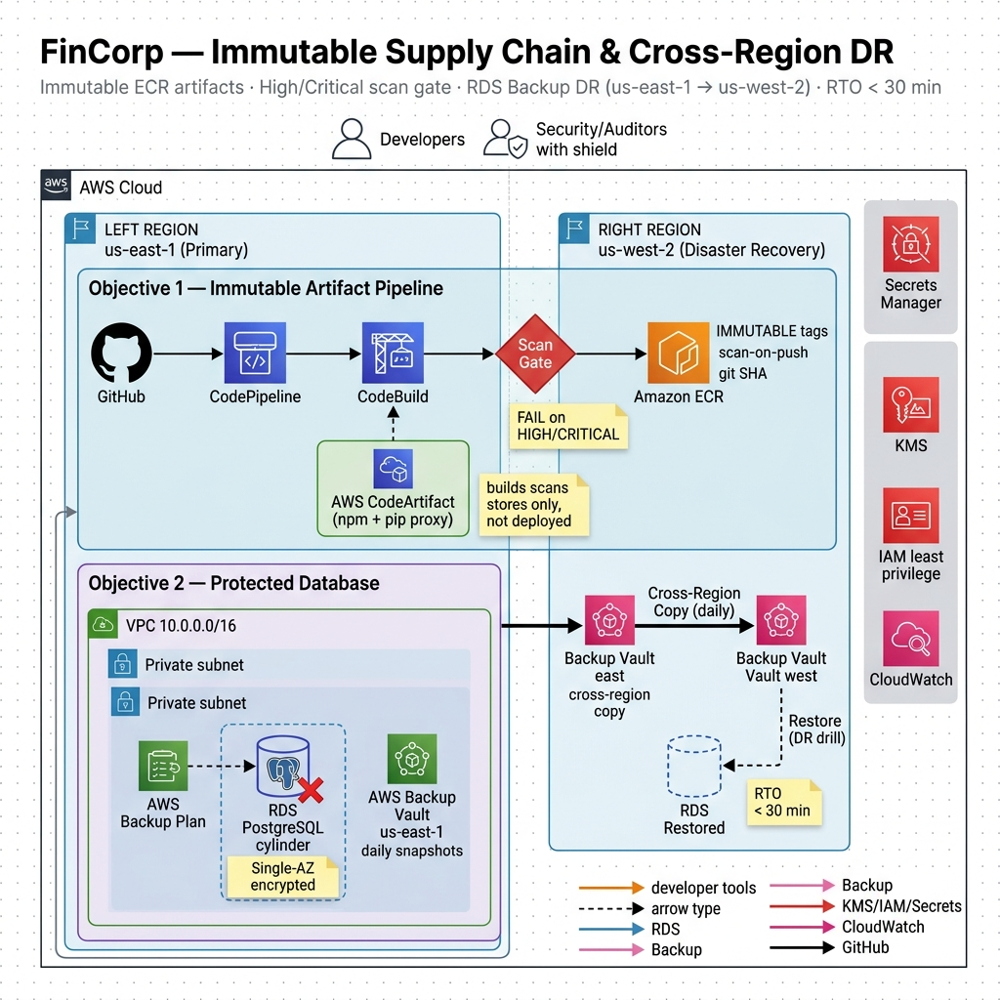
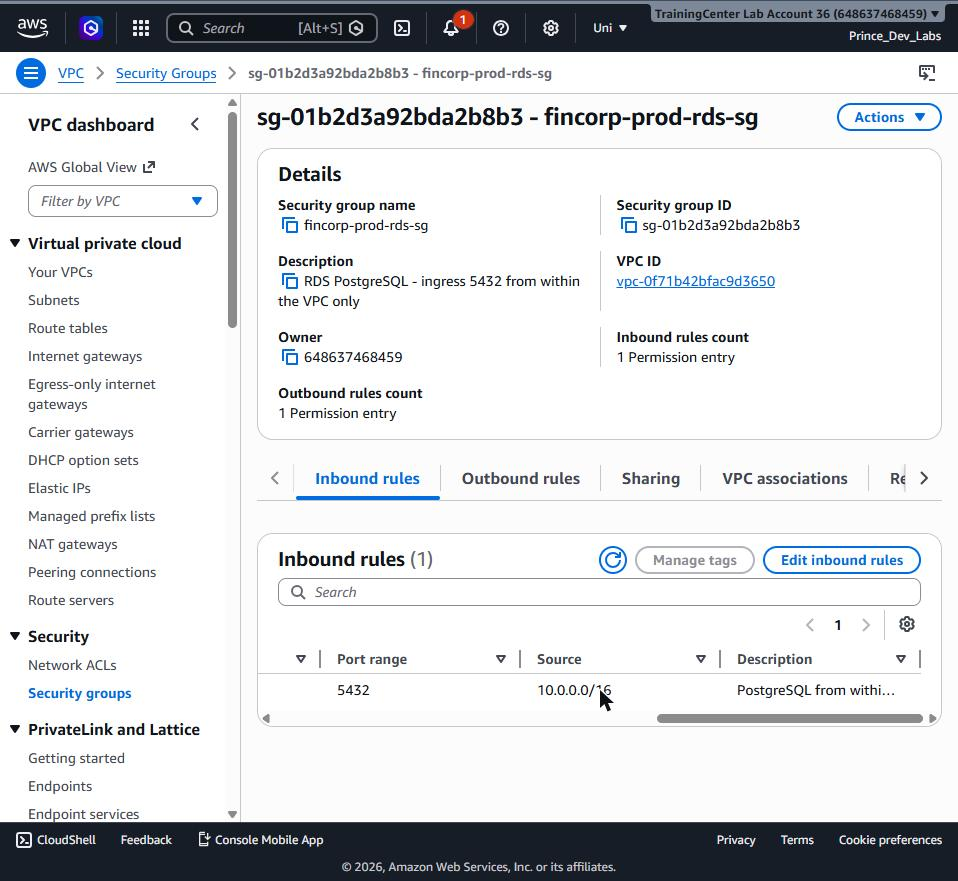

# FinCorp: Immutable Supply Chain &amp; Cross-Region Disaster Recovery

A production-style DevOps lab that delivers two capabilities for a security-conscious financial organisation, provisioned entirely with **Terraform** on AWS, and documented end-to-end with reproducible steps and captured evidence. The first is a **secure, auditable software supply chain** that builds container images, pushes them to an immutable registry, scans them, and **refuses to ship anything carrying a High or Critical vulnerability**. The second is a **cross-region disaster-recovery** plan that survives losing an entire region and restores a critical database elsewhere in **under 30 minutes** — proven with a timed drill, not asserted.

The application under test is a table-tennis league app (an Angular front end installed via npm and a Django backend installed via pip). FinCorp does not *run* the app — Objective 1 only builds, scans, and stores its immutable image; Objective 2 is a standalone Amazon RDS + AWS Backup disaster-recovery drill. The build, scan, and recovery machinery is the subject, not the application.

---

## Table of Contents

- [Motivation](#motivation)
- [Architecture](#architecture)
- [Build Walkthrough and Evidence](#build-walkthrough-and-evidence)
- [Results](#results)
- [Prerequisites](#prerequisites)
- [Installation and Setup](#installation-and-setup)
- [Usage](#usage)
- [Project Structure](#project-structure)
- [Key Technologies](#key-technologies)
- [Learning Outcomes](#learning-outcomes)
- [Challenges and Solutions](#challenges-and-solutions)
- [Future Improvements](#future-improvements)
- [Contributing](#contributing)
- [License](#license)
- [Author](#author)

---

## Motivation

Security and recoverability are easy to claim and hard to prove. Most "secure pipeline" and "disaster recovery" write-ups describe controls that were never tested failing, and recovery plans whose recovery time is genuinely unknown until an outage forces the issue. This project removes both gaps by building the controls for real and then **deliberately breaking things to prove they hold** — a build is shipped with a known-vulnerable base image to confirm the gate blocks it, and the primary database is deleted to confirm the cross-region copy can bring it back inside the time budget.

The work was structured as a six-phase lab, each phase ending with verified evidence and a written chapter:

1. **Foundation** — provision the network, an immutable scanned registry, and a controlled dependency proxy with Terraform.
2. **Secure pipeline** — a CodePipeline/CodeBuild pipeline that pulls dependencies through CodeArtifact, builds the image, and pushes it to Amazon ECR by git SHA.
3. **Prove the gate** — introduce a High/Critical vulnerability on purpose and show the build fails.
4. **DR foundation** — an Amazon RDS database, with AWS Backup taking daily snapshots and copying them to a second region.
5. **DR drill** — simulate a region failure by deleting the primary, restore from the cross-region copy, and measure the recovery time against a 30-minute RTO.
6. **Documentation** — a learning-oriented chapter per phase plus a live-walkthrough script.

The intent was to practise least-privilege IAM, supply-chain integrity, cost-aware architecture, and the operational reality of disaster recovery — and to make every claim defensible with a screenshot or a measured number.

> **A note on regions.** The brief specified a DR region of `us-west-2`. An AWS Organizations Service Control Policy (`p-339lo1q0`) on the lab account explicitly denies AWS Backup write actions in `us-west-2` and every US/CA region. The DR region was therefore retargeted to **`eu-west-1`** — a genuinely separate region, which satisfies the cross-region objective fully (the 30-minute RTO target is region-agnostic). The Terraform provider alias name `aws.usw2` was kept to minimise churn and is documented in the code.

---

## Architecture

Two AWS regions, one Terraform root. The **primary region (`us-east-1`)** hosts the entire supply chain and the protected database; the **DR region (`eu-west-1`)** receives the cross-region backup copies and is where recovery happens. The supply-chain services are regional and need no VPC; the database lives in a lean, private, RDS-only VPC with no Internet Gateway or NAT.



A commit on GitHub triggers CodePipeline through a CodeStar connection; CodeBuild authenticates to **AWS CodeArtifact** (the single proxy for every npm and pip dependency), builds the image, tags it by **git short SHA**, and pushes it to **Amazon ECR** with tag immutability and scan-on-push enabled. A scan gate fails the build on any unwaived High/Critical finding, so a vulnerable image can never be cleared. Separately, an **Amazon RDS** PostgreSQL instance in `us-east-1` is protected by **AWS Backup**: a daily plan snapshots it and a copy action replicates every recovery point into a vault in `eu-west-1`, so a total loss of the primary region cannot take the data with it.

Each phase also has an **interactive, animated deep-dive** (an "AWS class" on the Terraform and the decisions behind it), useful for studying the architecture module by module:

- [Phase 1 — Foundation](https://claude.ai/code/artifact/8977954c-a98e-4429-84b1-4c3be98b36a2) · value-flow explorer
- [Phase 2 — Secure Pipeline](https://claude.ai/code/artifact/b34c0a94-eb56-4d11-b0b9-8c7c3aa162b1) · interactive scan gate
- [Phase 3 — Proving the Gate](https://claude.ai/code/artifact/78cda8cd-3dd9-4ad5-8238-647095c5c706) · gate-logic matrix
- [Phase 4 — DR Safety Net](https://claude.ai/code/artifact/eab477d5-f34c-479a-9a3e-52a13ec94cd0) · cross-region copy
- [Phase 5 — Timed Failover](https://claude.ai/code/artifact/34b80062-80bc-4f2f-b691-5836b0a57564) · RTO stopwatch

---

## Build Walkthrough and Evidence

Each phase below links to its full chapter and shows representative captured evidence. Complete chapters and the live-walkthrough script live in [`docs/`](docs/).

### Phase 1 — Foundation (network, ECR, CodeArtifact)

The substrate, provisioned as code: a private RDS-only network, an immutable scanned registry, and the single controlled door for every dependency.




Full chapter: [`docs/phase-1-foundation.md`](docs/phase-1-foundation.md).

### Phase 2 — Secure pipeline (CodePipeline + CodeBuild)

A commit becomes two SHA-tagged, scanned, immutable images via GitHub → CodePipeline → two parallel CodeBuild actions, with dependencies pulled through CodeArtifact.


Full chapter: [`docs/phase-2-pipeline.md`](docs/phase-2-pipeline.md).

### Phase 3 — Proving the gate

The control is only meaningful if it blocks. A knowingly vulnerable base image is fed to the pipeline; the gate stops it, then a clean build passes honestly.


Full chapter: [`docs/phase-3-gate.md`](docs/phase-3-gate.md).

### Phase 4 — DR foundation (RDS + AWS Backup cross-region copy)

A private encrypted database, a daily backup plan, and a copy action that replicates every recovery point into the DR region.


Full chapter: [`docs/phase-4-dr-foundation.md`](docs/phase-4-dr-foundation.md).

### Phase 5 — DR drill and RTO measurement

The primary was deleted to simulate a region failure and restored from the copied snapshot in `eu-west-1`. End-to-end recovery time was **26 minutes 2 seconds**, inside the 30-minute target.


Full chapter: [`docs/phase-5-dr-drill.md`](docs/phase-5-dr-drill.md). A rehearsable demo running order is in [`docs/walkthrough.md`](docs/walkthrough.md).

---

## Results

Both objectives were built and proven with captured evidence and measured numbers.

| Objective | Requirement | Result | Evidence |
|-----------|-------------|--------|:--------:|
| Immutable artifacts | Tags never overwritten, scanned on push | ECR `IMMUTABLE` + scan-on-push + AES-256, tagged by git SHA | Phase 1–2 |
| Controlled dependencies | All npm/pip via one proxy | CodeArtifact upstream proxy; token injected as a BuildKit secret, never layered | Phase 2 |
| Scan gate blocks | Fail build on High/Critical | **GATE FAILED on 29 HIGH/CRITICAL** (run `641c443b`) | Phase 3 |
| Scan gate passes honestly | Green only when clean/accepted | **GATE PASSED — 0 blocking** (4 allowlisted, run `8e1f45da`) | Phase 3 |
| Cross-region copy | Daily snapshot copied to a second region | Recovery point COMPLETED in `eu-west-1` vault | Phase 4 |
| Recovery time | Restore in a different region &lt; 30 min | **RTO 26m 02s** (disaster 13:48:49Z → recovered 14:14:51Z) | Phase 5 |

**Outcome:** the supply chain produces only immutable, scanned artifacts and is proven to block a vulnerable one; the database survives losing its entire region and is recoverable well within the 30-minute objective. Every architectural choice was made cost-aware — no NAT gateway, single-AZ RDS, basic ECR scanning with a curated allowlist, and S3-native state locking with no DynamoDB — and the whole stack has a verified teardown path that returns it to $0.

---

## Prerequisites

- An AWS account with permissions to create VPC, ECR, CodeArtifact, CodeBuild, CodePipeline, IAM, RDS, AWS Backup, and Secrets Manager resources (note: AWS Backup is region-restricted by SCP on the lab account — see the regions note above)
- Terraform 1.10 or newer (native S3 state locking, no DynamoDB)
- AWS CLI v2, configured with `aws configure`
- The GitHub CLI (`gh`) or console access to authorize the CodeStar connection
- A GitHub repository holding this source, for the pipeline's Source stage
- An S3 bucket for Terraform remote state, referenced in [`infra/terraform/envs/prod/backend.tf`](infra/terraform/envs/prod/backend.tf)

---

## Installation and Setup

The entire stack is one Terraform root with `aws` (primary, `us-east-1`) and `aws.usw2` (DR, `eu-west-1`) provider aliases. Everything bills while running — see Teardown.

### 1 — Bootstrap remote state

The state bucket is created once with the CLI before Terraform can use it.

```bash
aws s3api create-bucket --bucket fincorp-tfstate-<account-id>-use1 --region us-east-1
aws s3api put-bucket-versioning --bucket fincorp-tfstate-<account-id>-use1 \
  --versioning-configuration Status=Enabled
aws s3api put-public-access-block --bucket fincorp-tfstate-<account-id>-use1 \
  --public-access-block-configuration BlockPublicAcls=true,IgnorePublicAcls=true,BlockPublicPolicy=true,RestrictPublicBuckets=true
# update the bucket name in infra/terraform/envs/prod/backend.tf to match
```

### 2 — Provision the stack

```bash
cd infra/terraform/envs/prod
terraform init
terraform apply        # network, ECR, CodeArtifact, CodeBuild, CodePipeline, RDS, AWS Backup
```

### 3 — Authorize the GitHub source (one manual step)

Terraform creates the CodeStar connection in `PENDING`; the OAuth handshake must be approved by a human.

```
AWS Console → Developer Tools → Settings → Connections → fincorp-prod-gh
  → Update pending connection → authorize the AWS Connector for GitHub → Connect
# status flips to AVAILABLE; the pipeline can now pull the source branch
```

### 4 — Run the pipeline and verify the gate

```bash
aws codepipeline start-pipeline-execution --name fincorp-prod-pipeline --region us-east-1
# both tiers build, scan, and push; the gate passes only with 0 blocking High/Critical
```

### Teardown

Amazon RDS and the backup vaults bill continuously. Destroy everything when you are not demonstrating it. ECR repositories are `IMMUTABLE` and the vaults hold recovery points, so both must be emptied before `terraform destroy`.

```bash
# 1. empty the ECR repos (immutable repos refuse deletion while holding images)
for R in fincorp-frontend fincorp-backend; do
  aws ecr batch-delete-image --repository-name "$R" --region us-east-1 \
    --image-ids "$(aws ecr list-images --repository-name "$R" --region us-east-1 --query 'imageIds[*]' --output json)"
done

# 2. delete recovery points from both vaults (so the vaults can be destroyed)
aws backup delete-recovery-point --backup-vault-name fincorp-prod-vault-use1 \
  --recovery-point-arn <source-rp-arn> --region us-east-1
aws backup delete-recovery-point --backup-vault-name fincorp-prod-vault-dr \
  --recovery-point-arn <dr-rp-arn> --region eu-west-1

# 3. destroy the Terraform-managed stack (both regions)
cd infra/terraform/envs/prod && terraform destroy

# 4. clean up any drill-created eu-west-1 resources NOT in Terraform state
#    (restored DB instance, its DB subnet group, its security group), then the state bucket.
```

---

## Usage

```bash
# Trigger a pipeline run and watch it
aws codepipeline start-pipeline-execution --name fincorp-prod-pipeline --region us-east-1

# Inspect an image's scan findings (the gate reads these)
aws ecr describe-image-scan-findings --repository-name fincorp-backend \
  --image-id imageTag=<git-sha> --region us-east-1

# Take an on-demand backup with a cross-region copy (seed a recovery point)
aws backup start-backup-job --backup-vault-name fincorp-prod-vault-use1 \
  --resource-arn <rds-arn> --iam-role-arn <backup-role-arn> --region us-east-1

# Run the DR drill: simulate region failure, then restore in eu-west-1
aws rds delete-db-instance --db-instance-identifier fincorp-prod-postgres \
  --skip-final-snapshot --delete-automated-backups --region us-east-1
aws backup start-restore-job --region eu-west-1 \
  --recovery-point-arn <dr-rp-arn> --iam-role-arn <backup-role-arn> --resource-type RDS \
  --metadata DBInstanceIdentifier=fincorp-prod-postgres-dr,DBSubnetGroupName=<dr-subnet-group>,...
```

---

## Project Structure

```
fincorp-immutable-dr/
├── apps/
│   ├── frontend/                 # Angular app (npm), multi-stage Dockerfile, nginx
│   └── backend/                  # Django app (pip), multi-stage Dockerfile, daphne
├── infra/terraform/
│   ├── modules/
│   │   ├── network/              # private RDS-only VPC, subnets, DB subnet group, SG
│   │   ├── ecr/                  # immutable, scan-on-push, AES-256 repos + lifecycle
│   │   ├── codeartifact/         # domain + npm/pip upstream-proxy topology
│   │   ├── codebuild/            # per-tier projects + buildspecs + scan gate + IAM
│   │   ├── codepipeline/         # CodeStar connection, pipeline, IAM
│   │   ├── rds/                  # PostgreSQL, private, encrypted, managed credential
│   │   ├── secrets/              # (unwired — RDS manages its own credential)
│   │   └── backup/               # source + DR vaults, daily plan, copy_action, role
│   └── envs/prod/                # single root: aws (us-east-1) + aws.usw2 (eu-west-1)
├── security/scan-allowlist.txt   # accepted-risk register of unfixable CVEs (dated)
├── docs/                         # phase chapters, walkthrough script, assets/ (evidence)
├── .claude/
│   ├── agents/                   # infra-engineer, pipeline-engineer, docs-scribe, platform-reviewer
│   └── skills/                   # provisioning-aws-infra, securing-supply-chain, disaster-recovery, writing-readmes, …
├── capture_window.ps1 · capture_tab.ps1   # screenshot bridge (Chrome window/tab → PNG)
├── AGENTS.md                     # operating contract (read first)
└── README.md
```

The scan gate's allowlist (`security/scan-allowlist.txt`) is read by the buildspec at build time, so accepting an upstream-unfixable CVE is a reviewed, version-controlled change — not a silent flag in CI.

---

## Key Technologies

- **AWS CodeArtifact** — a single npm + pip proxy with an upstream/external-connection topology; chosen so every dependency is recorded and curatable at one control point, with no direct public-registry pulls from the build.
- **AWS CodePipeline + CodeBuild** — orchestration and managed build compute; CodeBuild runs privileged to build the Docker image and carries the deps → build → push → scan-gate logic per tier.
- **Amazon ECR** — private registry with tag immutability and scan-on-push; chosen because immutable, SHA-tagged images are the spine of a traceable supply chain.
- **CodeStar / CodeConnections** — a brokered, revocable GitHub source connection; chosen over a long-lived personal access token to avoid a secret to rotate and a leak blast radius.
- **Amazon RDS for PostgreSQL** — managed database with an RDS-managed master credential in Secrets Manager; chosen so no password ever lands in Terraform state.
- **AWS Backup** — daily plan with a cross-region `copy_action`; chosen as the lowest-cost DR pattern (Backup &amp; Restore) that still meets a 30-minute RTO by pre-positioning the recovery point in the DR region.
- **Terraform** — all infrastructure declarative, modular, with remote S3 state and native lockfile locking (no DynamoDB).
- **ECR basic scanning with a CVE allowlist** — chosen over Amazon Inspector (enhanced) to keep cost down; the curated allowlist supplies the "fixable vs unfixable" judgment that basic scanning's findings lack.

---

## Learning Outcomes

- Built a supply chain whose scan gate genuinely *blocks* — verified by failing a build on 29 High/Critical findings, not by asserting it would.
- Diagnosed and fixed a fail-open gate defect (the ECR basic-scan summary returning `null`), hardening it to count from the authoritative per-finding list.
- Designed an auditable accepted-risk register for upstream-unfixable CVEs, keeping a strict gate from over-blocking while staying meaningful for new fixable findings.
- Authored modular Terraform across two regions from a single root using provider aliases, and handled an Organizations SCP that forced a DR-region change.
- Implemented least-privilege IAM for CodeBuild, CodePipeline, and AWS Backup, with the only wildcards being the two AWS APIs that cannot be resource-scoped.
- Executed and *timed* a cross-region disaster-recovery drill, recovering a deleted database in 26m02s against a 30-minute objective, and captured the operational gotchas along the way.

---

## Challenges and Solutions

### Docker Hub pull rate limits failed the build

**Problem:** CodeBuild failed pulling the base images with `429 Too Many Requests` from `registry-1.docker.io`.

**Root cause:** Anonymous Docker Hub pulls from a shared CodeBuild egress IP are aggressively rate-limited.

**Solution:** Switched the Dockerfile base images to the ECR Public mirror (`public.ecr.aws/docker/library/...`), which CodeBuild reaches without Docker Hub's anonymous limits.

### The scan gate failed open

**Problem:** An early gate trusted ECR's `findingSeverityCounts` summary, which on basic scanning returns `null` even when High/Critical findings exist — so the gate scored `null` as zero and would have passed a vulnerable image.

**Root cause:** The convenient summary field is unreliable for basic scanning; only the per-finding list is authoritative.

**Solution:** Rewrote the gate to page through `imageScanFindings.findings[]` and count High/Critical directly. The deliberately vulnerable image then correctly failed at 29 findings.

### A strict gate could never go green

**Problem:** Current base images carry High/Critical OS CVEs with no upstream fix yet, so a strict zero-tolerance gate blocked even a clean build forever.

**Root cause:** ECR basic scanning exposes no `fixedInVersion` field, so the gate cannot automatically distinguish fixable from unfixable findings; Amazon Inspector (which does) was a deliberate cost no.

**Solution:** Added an explicit, dated CVE-ID allowlist (`security/scan-allowlist.txt`) of reviewed upstream-unfixable CVEs. The gate blocks any High/Critical *not* on the list, so a new fixable CVE still fails the build.

### The DR region was blocked by an org policy

**Problem:** `aws backup create-backup-vault --region us-west-2` failed with an explicit `AccessDenied` from a Service Control Policy.

**Root cause:** An Organizations SCP (`p-339lo1q0`) denies AWS Backup write actions in `us-west-2` and all US/CA regions — a boundary that cannot be overridden with IAM.

**Solution:** Retargeted the DR region to `eu-west-1` (allowed by the SCP), kept the `aws.usw2` provider alias name to limit churn, and documented the deviation. The 30-minute RTO is region-agnostic, so the objective is unaffected.

### The first restore was rejected

**Problem:** During the drill, `start-restore-job` failed with `DBName must be null when restoring for this engine`.

**Root cause:** The restore metadata carried a `DBName`, which a PostgreSQL restore does not accept.

**Solution:** Dropped `DBName` from the restore metadata and re-ran. Surfacing this in a drill — rather than during a real incident — is precisely the value of testing DR; recovery still finished in 26m02s including the retry.

---

## Future Improvements

- Enable Amazon Inspector (enhanced ECR scanning) to gain language-dependency findings and a `fixedInVersion` field, replacing the manual CVE allowlist with automatic fixable/unfixable triage.
- Provision the DR-region landing zone (VPC, DB subnet group, security group) in Terraform so recovery is a pure restore with no on-the-fly networking.
- Run RDS Multi-AZ and use a customer-managed KMS key for tighter key governance in a production posture (the lab uses single-AZ and AWS-managed keys for cost).
- Automate the CodeStar connection approval where the org allows it, removing the one manual step.
- Tighten the CodeArtifact token lifetime from 12h toward the build's actual duration.
- Add CloudWatch alarms and a budget so idle DR resources never bill silently.

---

## Contributing

Contributions and suggestions are welcome.

1. Fork the repository.
2. Create a feature branch.
3. Commit your changes with clear messages.
4. Open a pull request describing the change and its rationale.

For substantial changes, please open an issue to discuss the approach first.

---

## License

This project is released under the MIT License.

---

## Author

**Prince Ayiku** — DevOps and Cloud Engineering

- GitHub: [@celetrialprince166](https://github.com/celetrialprince166)
- Email: prince.ayiku@amalitechtraining.org
