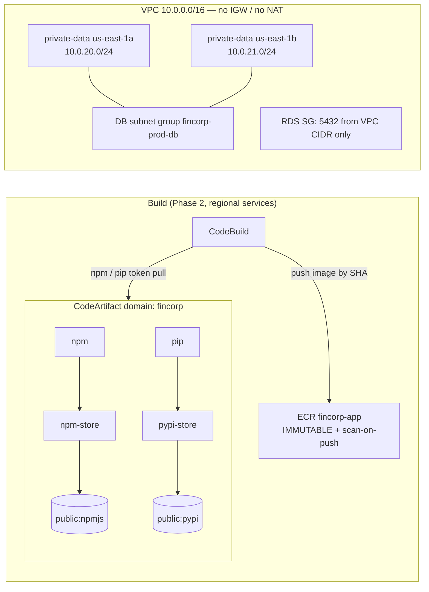
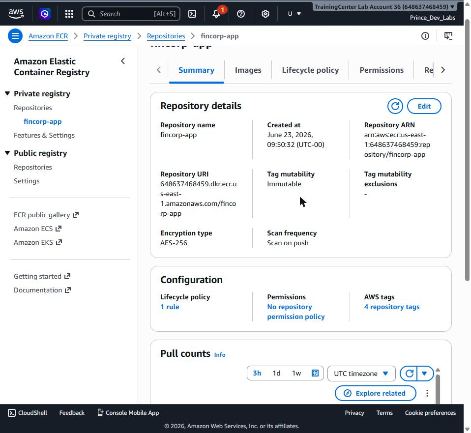
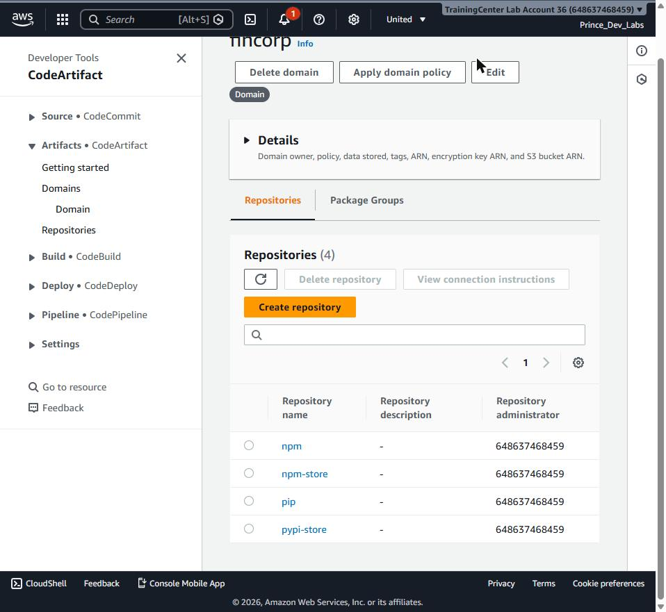
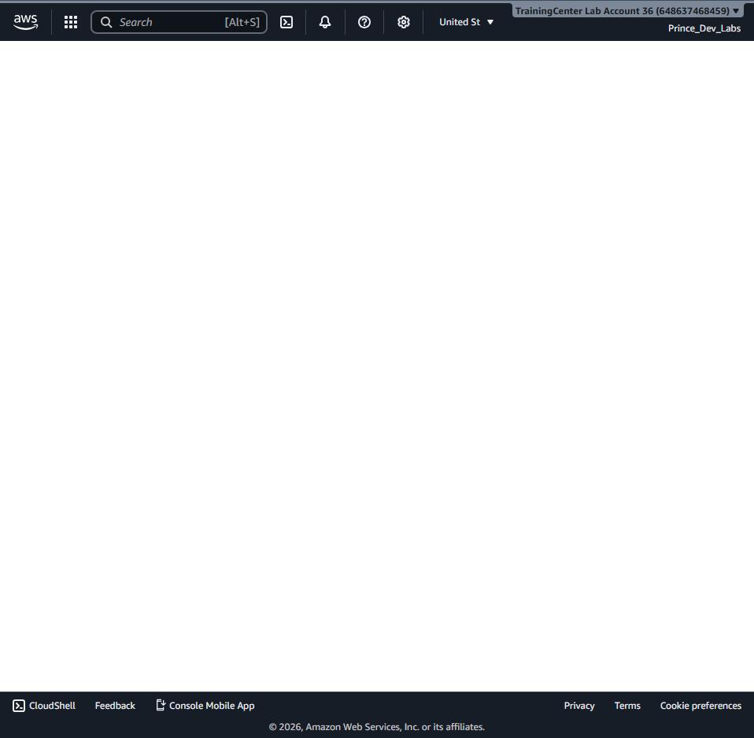

# Phase 1 — Terraform foundation: network, ECR, CodeArtifact

## Goal

Phase 1 lays the ground floor everything else stands on: a lean private network
for the database, an **immutable, scan-on-push ECR repository** for the build
artifact, and a **CodeArtifact domain** that becomes the single controlled source
for every npm and pip dependency the pipeline will pull. Nothing here runs the
application — FinCorp only builds, scans, and stores the immutable image
(Objective 1) and protects a database (Objective 2). This phase provisions the
shared scaffolding both objectives depend on, and wires up an S3 remote state
backend so the infrastructure is reproducible and team-safe from the first apply.

All resources land in **us-east-1**, account **648637468459**.

## Prerequisites

- Terraform **>= 1.10** (native S3 state locking via `use_lockfile` needs 1.10+).
- AWS CLI v2 authenticated to account `648637468459` with permissions for VPC,
  ECR, CodeArtifact, S3, and STS.
- The repo cloned locally; work from `infra/terraform/envs/prod`.
- An S3 bucket for remote state. We bootstrap it once with the CLI (below) because
  the bucket must exist before `terraform init` can use it as a backend.

## Concepts (the "why")

This phase is small on resource count but deliberate on posture. Five choices
matter, and each carries a trade-off worth stating.

**Immutable ECR tags + scan-on-push.** The repository is created with
`image_tag_mutability = "IMMUTABLE"` and `scan_on_push = true`. Immutability means
an image tagged with a git short SHA can never be overwritten — the tag you
audited is the exact bytes that ship, so the artifact is traceable end to end. The
trade-off is operational discipline: you can't re-push `:latest` to "fix" an image;
you cut a new SHA. Scan-on-push runs the ECR/Inspector vulnerability scan the moment
an image arrives, which is what the Phase 2 CodeBuild gate later reads to fail a
build on any High/Critical finding. Encryption is `AES256` (S3-managed) — enough for
this lab without the key-management overhead of a customer-managed KMS key.

**CodeArtifact as the single controlled dependency source.** Rather than letting the
build reach out to npmjs and PyPI directly, every npm and pip package is proxied
through a CodeArtifact domain. The topology is two layers: `*-store` repos hold the
external connection to the public registry (`public:npmjs`, `public:pypi`), and the
`npm`/`pip` repos upstream to their store. The build authenticates with a
short-lived token and pulls **everything through** the `npm` and `pip` repos, so
there are no uncontrolled public pulls — every package is proxied, recorded, and
curatable. A repo may declare an external connection *or* upstreams, never both,
which is why the split exists. Trade-off: one extra hop and a token step in the
build, in exchange for a fully auditable supply chain.

**Lean, RDS-only VPC with no NAT.** The only thing that will ever live in this VPC
is the primary RDS PostgreSQL instance (Objective 2). CodeArtifact, CodeBuild, and
ECR are regional AWS services and need no VPC wiring. So the network is intentionally
minimal: a `10.0.0.0/16` VPC, two private data subnets across two AZs (RDS requires
at least two), a DB subnet group, and an RDS security group — and **no Internet
Gateway and no NAT Gateway**. NAT bills hourly plus per-GB, and a private database
with no outbound need doesn't justify it. Zero egress infrastructure means zero
egress billing. The trade-off: if a future need for outbound traffic appears, you
add an IGW + NAT or VPC endpoints then — not now.

**Least-privilege security group.** The RDS SG allows ingress on 5432 only from the
VPC CIDR (`10.0.0.0/16`), never `0.0.0.0/0`, and egress is scoped to the same VPC
CIDR rather than advertising `0.0.0.0/0`. With no IGW/NAT this egress rule is
effectively a no-op for reachability, but keeping it honest matches the
least-privilege posture and avoids a misleading "open to the world" rule in audits.

**S3 remote state with native lockfile locking.** State lives in a versioned,
AES256-encrypted, public-access-blocked S3 bucket. Locking uses Terraform's native
`use_lockfile` (1.10+) instead of a DynamoDB table — one less resource to provision,
pay for, and secure. Versioning on the bucket gives state history and a recovery path
if a state write goes wrong. Trade-off: native locking is newer than the DynamoDB
pattern, which is why we pin `required_version >= 1.10.0`.

### Topology



## Steps

All commands run from `infra/terraform/envs/prod` unless noted.

### 1. Bootstrap the remote-state bucket (one time)

The backend bucket must exist before `init`. Create it, then turn on versioning,
encryption, and a full public-access block.

```bash
BUCKET=fincorp-tfstate-648637468459-use1
REGION=us-east-1

# us-east-1 is special: no LocationConstraint.
aws s3api create-bucket --bucket "$BUCKET" --region "$REGION"

aws s3api put-bucket-versioning \
  --bucket "$BUCKET" \
  --versioning-configuration Status=Enabled

aws s3api put-bucket-encryption \
  --bucket "$BUCKET" \
  --server-side-encryption-configuration \
  '{"Rules":[{"ApplyServerSideEncryptionByDefault":{"SSEAlgorithm":"AES256"}}]}'

aws s3api put-public-access-block \
  --bucket "$BUCKET" \
  --public-access-block-configuration \
  BlockPublicAcls=true,IgnorePublicAcls=true,BlockPublicPolicy=true,RestrictPublicBuckets=true
```

The backend itself is declared in `backend.tf` — no DynamoDB table, locking is native:

```hcl
terraform {
  backend "s3" {
    bucket       = "fincorp-tfstate-648637468459-use1"
    key          = "fincorp/prod/terraform.tfstate"
    region       = "us-east-1"
    encrypt      = true
    use_lockfile = true
  }
}
```

### 2. Initialize, format, validate

```bash
terraform init      # configures the S3 backend, downloads the AWS provider
terraform fmt -recursive
terraform validate
```

`init` wires up remote state; `fmt` keeps the modules canonical; `validate` checks
the configuration is internally consistent before touching AWS.

### 3. Plan

```bash
terraform plan
```

The first foundation plan creates **14 resources**: the VPC, two private subnets,
the DB subnet group, the RDS SG plus its ingress/egress rules, the ECR repo and its
lifecycle policy, and the CodeArtifact domain with its four repos. See the captured
`plan-phase1.txt` for the full output.

### 4. Apply

```bash
terraform apply    # review the plan, type 'yes'
```

On completion Terraform prints the Phase 1 outputs:

```text
codeartifact_domain_name    = "fincorp"
codeartifact_domain_owner   = "648637468459"
codeartifact_npm_repository  = "npm"
codeartifact_pip_repository  = "pip"
db_subnet_group_name        = "fincorp-prod-db"
ecr_repository_urls = {
  "app" = "648637468459.dkr.ecr.us-east-1.amazonaws.com/fincorp-app"
}
private_data_subnet_ids = [
  "subnet-0788c79bfa91866d9",
  "subnet-0a87f809fc79d0503",
]
rds_sg_id = "sg-01b2d3a92bda2b8b3"
vpc_id    = "vpc-0f71b42bfac9d3650"
```


## Verification

Confirm the live state matches the design with read-only AWS CLI calls.

### ECR — immutable, scan-on-push, AES256

```bash
aws ecr describe-repositories \
  --repository-names fincorp-app \
  --region us-east-1
```

```json
{
  "repositories": [
    {
      "repositoryArn": "arn:aws:ecr:us-east-1:648637468459:repository/fincorp-app",
      "registryId": "648637468459",
      "repositoryName": "fincorp-app",
      "repositoryUri": "648637468459.dkr.ecr.us-east-1.amazonaws.com/fincorp-app",
      "imageTagMutability": "IMMUTABLE",
      "imageScanningConfiguration": { "scanOnPush": true },
      "encryptionConfiguration": { "encryptionType": "AES256" }
    }
  ]
}
```

`imageTagMutability` is `IMMUTABLE` and `scanOnPush` is `true` — the two
non-negotiables hold. The lifecycle policy keeps the last 15 images:

```bash
aws ecr get-lifecycle-policy --repository-name fincorp-app --region us-east-1
```

```json
{
  "lifecyclePolicyText": "{\"rules\":[{\"rulePriority\":1,\"description\":\"Keep last 15 images\",\"selection\":{\"tagStatus\":\"any\",\"countType\":\"imageCountMoreThan\",\"countNumber\":15},\"action\":{\"type\":\"expire\"}}]}"
}
```



### CodeArtifact — domain + four repos

```bash
aws codeartifact list-repositories-in-domain \
  --domain fincorp --domain-owner 648637468459 \
  --region us-east-1
```

```json
{
  "repositories": [
    { "name": "npm",        "domainName": "fincorp", "domainOwner": "648637468459" },
    { "name": "npm-store",  "domainName": "fincorp", "domainOwner": "648637468459" },
    { "name": "pip",        "domainName": "fincorp", "domainOwner": "648637468459" },
    { "name": "pypi-store", "domainName": "fincorp", "domainOwner": "648637468459" }
  ]
}
```

All four repos exist: `npm` → `npm-store` → `public:npmjs`, and `pip` →
`pypi-store` → `public:pypi`. The build pulls through `npm` and `pip`.



### Network — RDS SG scoped to the VPC CIDR

```bash
aws ec2 describe-security-groups \
  --group-ids sg-01b2d3a92bda2b8b3 --region us-east-1 \
  --query "SecurityGroups[0].{Ingress:IpPermissions,Egress:IpPermissionsEgress}"
```

```json
{
  "Ingress": [
    { "IpProtocol": "tcp", "FromPort": 5432, "ToPort": 5432,
      "IpRanges": [ { "CidrIp": "10.0.0.0/16", "Description": "PostgreSQL from within the VPC" } ] }
  ],
  "Egress": [
    { "IpProtocol": "-1",
      "IpRanges": [ { "CidrIp": "10.0.0.0/16", "Description": "Allow egress within the VPC" } ] }
  ]
}
```

Both ingress (5432) and egress are scoped to `10.0.0.0/16` — no `0.0.0.0/0`
anywhere. The VPC `vpc-0f71b42bfac9d3650` has no IGW or NAT.



### Remote state — versioning on the bucket

```bash
aws s3api get-bucket-versioning --bucket fincorp-tfstate-648637468459-use1
```

```json
{ "Status": "Enabled" }
```

## Evidence

Raw, timestamped command captures from the build are committed alongside the
Terraform root for audit:

- `infra/terraform/envs/prod/plan-phase1.txt` — the full `terraform plan`
  (`Plan: 14 to add, 0 to change, 0 to destroy`) and the planned outputs.
- `infra/terraform/envs/prod/apply-phase1.txt` — the `terraform apply` log showing
  resource creation and the final outputs (VPC `vpc-0f71b42bfac9d3650`, SG
  `sg-01b2d3a92bda2b8b3`, ECR URL, subnet IDs).

Console screenshots backing the verification step live in
[`docs/assets/`](assets/) — see [`assets/README.md`](assets/README.md) for the index.

## Troubleshooting

- **`terraform init` fails: backend bucket not found.** The state bucket must be
  bootstrapped with the CLI *before* `init`. Run the Step 1 commands first.
- **`use_lockfile` unrecognized / locking errors.** This needs Terraform >= 1.10.
  Check `terraform version`; the root pins `required_version >= 1.10.0`.
- **CodeArtifact "repository cannot have both upstream and external connection".**
  Keep the two-layer split: `*-store` repos hold the external connection, the
  `npm`/`pip` repos hold only the upstream. Never put both on one repo.
- **Stale egress evidence.** Early plan/apply captures show the RDS SG egress as
  `0.0.0.0/0`; the module was tightened to the VPC CIDR afterward. The live state
  (and current source) scope egress to `10.0.0.0/16` — verify against the CLI, not
  the older text capture.

## Cost & teardown

**While running**, Phase 1 is close to free: the VPC, subnets, DB subnet group, and
security group cost nothing; ECR charges only for stored image bytes (none yet);
CodeArtifact charges for stored artifacts and requests (negligible until the
pipeline runs); S3 state is a few KB. **There is no NAT Gateway, so there is no
hourly egress charge** — that's the main reason this VPC is deliberately
IGW/NAT-free.

To tear down, destroy the Terraform-managed resources first, then remove the state
bucket (it is not managed by this root, so it must be deleted manually):

```bash
# from infra/terraform/envs/prod
terraform destroy        # review, type 'yes' — removes all 14 Phase 1 resources

# then delete the remote-state bucket (versioned: empty all versions first)
BUCKET=fincorp-tfstate-648637468459-use1
aws s3api delete-objects --bucket "$BUCKET" \
  --delete "$(aws s3api list-object-versions --bucket "$BUCKET" \
    --query '{Objects: Versions[].{Key:Key,VersionId:VersionId}}' --output json)"
aws s3api delete-objects --bucket "$BUCKET" \
  --delete "$(aws s3api list-object-versions --bucket "$BUCKET" \
    --query '{Objects: DeleteMarkers[].{Key:Key,VersionId:VersionId}}' --output json)"
aws s3api delete-bucket --bucket "$BUCKET" --region us-east-1
```

Note: deleting the state bucket is irreversible and orphans the Terraform state —
only do it when you are fully done with the lab. All Phase 1 resources are in
us-east-1; there is nothing to tear down in us-west-2 yet (the DR region comes
online in Phase 4).

## Key takeaways

- ECR is **immutable + scan-on-push** from day one — the artifact trust model is set
  before a single image exists.
- **CodeArtifact is the only door** to npm and pip; the build never pulls from public
  registries directly.
- The VPC is **RDS-only with no NAT** — least privilege and zero egress billing by
  design, not by accident.
- Security groups are scoped to the **VPC CIDR**, never `0.0.0.0/0`, on both ingress
  and egress.
- Remote state is **S3 + native lockfile** (no DynamoDB), versioned and encrypted,
  needing Terraform 1.10+.
