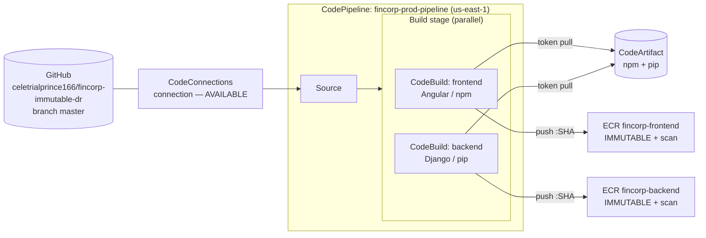
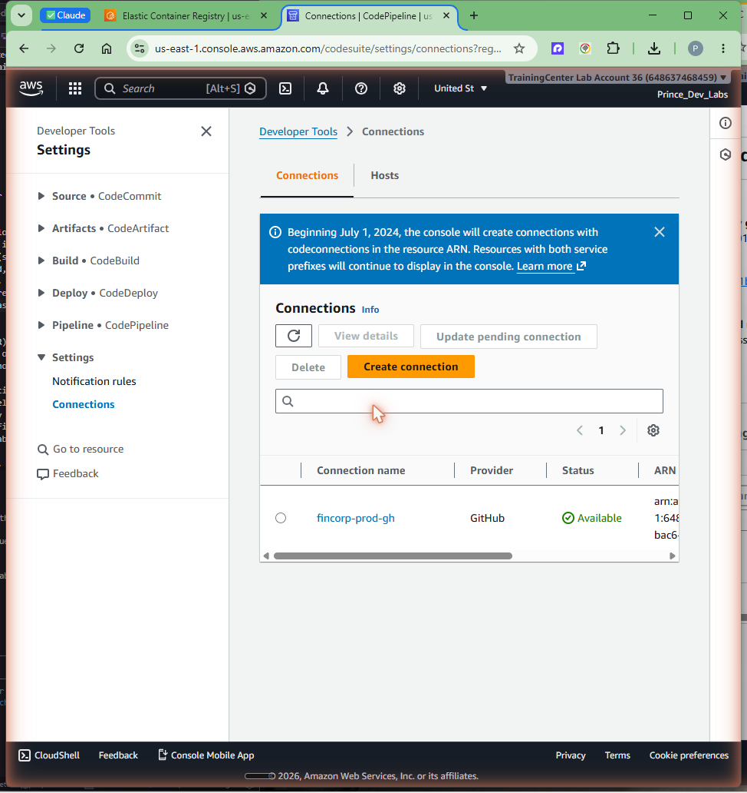
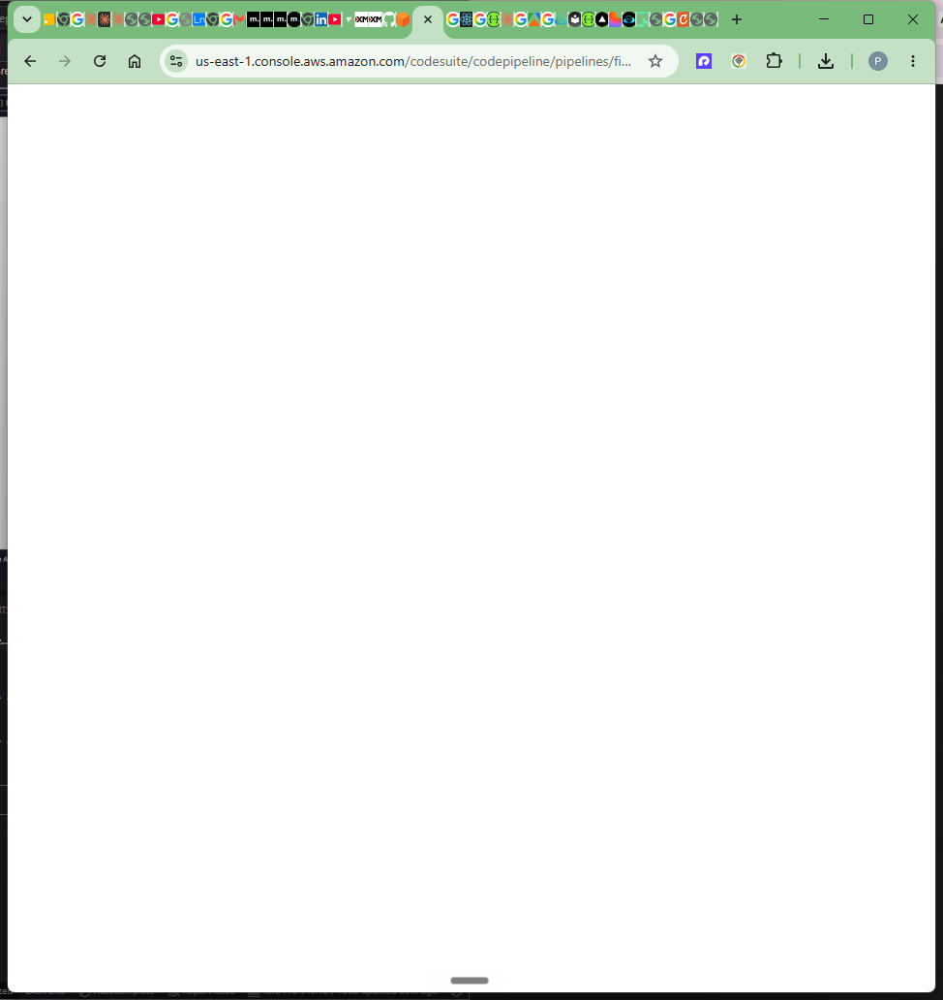
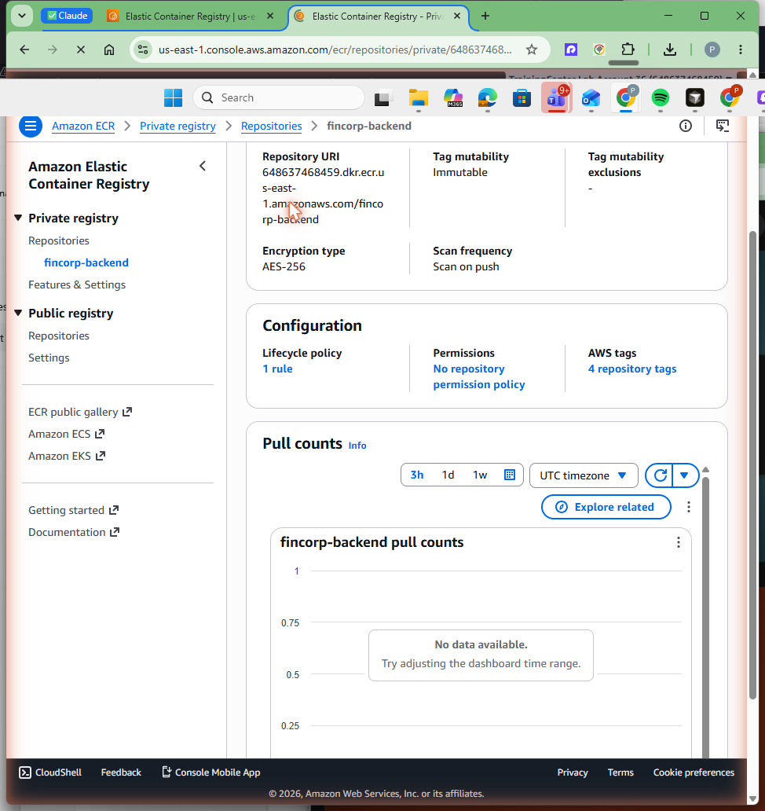

# Phase 2 — Secure pipeline: CodePipeline + CodeBuild

## Goal

Phase 1 set the trust model — an immutable, scan-on-push ECR repo and a
CodeArtifact proxy as the only door to npm and pip. Phase 2 builds the machine
that uses it: an AWS CodePipeline that pulls the pongapp source from GitHub,
runs two parallel CodeBuild jobs (the Angular frontend on npm, the Django
backend on pip), and pushes each as an **immutable, SHA-tagged container image**
into ECR where scan-on-push fires automatically. Every dependency is pulled
through CodeArtifact, and the CodeArtifact token is injected into the Docker
build as a BuildKit secret so it never lands in an image layer. The reward at
the end is the first all-green pipeline run.

All resources land in **us-east-1**, account **648637468459**.

## Prerequisites

- Phase 1 applied: the `fincorp-frontend` and `fincorp-backend` ECR repos
  (IMMUTABLE + scan-on-push) and the `fincorp` CodeArtifact domain with the
  `npm`/`pip` repos exist.
- AWS CLI v2 authenticated to `648637468459` with permissions for CodePipeline,
  CodeBuild, IAM, ECR, CodeArtifact, S3, and CodeConnections.
- A GitHub account that can authorize a connection to
  `celetrialprince166/fincorp-immutable-dr`.
- Terraform **>= 1.10**, run from `infra/terraform/envs/prod`.

## Concepts (the "why")

**Source via a CodeStar/CodeConnections connection, not a stored token.**
CodePipeline reaches GitHub through an AWS CodeConnections (formerly CodeStar)
connection rather than a personal access token committed somewhere or pasted
into a variable. The connection holds the OAuth grant on the AWS side, so there
is no long-lived secret in the repo or the pipeline definition. The trade-off is
**one unavoidable manual step**: a connection is created in `PENDING` status and
a human must click **Authorize** in the console once to move it to `AVAILABLE`.
Terraform can create the connection but cannot complete the OAuth handshake — so
this is the single documented manual action in the whole pipeline. It is a
one-time approval; nothing else here is click-ops.

**Two parallel build actions, one per tier.** The Build stage runs two CodeBuild
actions in parallel — frontend (Angular/npm) and backend (Django/pip). Splitting
them means a frontend dependency problem never blocks the backend build and each
tier gets its own buildspec, its own ECR repo, and its own scan gate. They run in
parallel because they share nothing at build time, so total wall-clock is the
slower of the two rather than the sum.

**CodeArtifact token as a BuildKit secret — never a layer.** Each buildspec fetches
a short-lived CodeArtifact auth token, renders it into an `npm`/`pip` config that
points the package manager at the CodeArtifact endpoint, and passes that config to
`docker build` with `--secret`. BuildKit mounts the secret only for the steps that
need it; it is **never written into a layer** and never ends up in the pushed image.
If we had instead `COPY`d a `.npmrc`/`pip.conf` with the token in, that token would
be permanently baked into the image history. The trade-off is that the buildspec is
a little more involved (render config → mount as secret), which is exactly the right
place to absorb that complexity.

**Immutable SHA tags.** Every image is tagged with the git short SHA of the commit
that produced it (`CODEBUILD_RESOLVED_SOURCE_VERSION`), never `:latest`. The ECR
repo is `IMMUTABLE`, so a given SHA tag can be pushed exactly once — the bytes you
scanned and audited are the exact bytes that exist forever under that tag.

**Buildspecs live inline in Terraform.** The two buildspecs are committed at
`modules/codebuild/buildspecs/frontend.yml` and `.../backend.yml` and wired into
the CodeBuild projects by Terraform — not stored as `buildspec.yml` at the repo
root. This keeps the build definition versioned with the infrastructure that runs
it. The consequence to remember: **changing a buildspec means re-applying Terraform**
(`terraform apply -target=module.codebuild`), not just pushing a new commit.

### Pipeline flow



## Steps

All commands run from `infra/terraform/envs/prod` unless noted.

### 1. Apply the pipeline infrastructure

Terraform creates the CodeConnections connection, the two CodeBuild projects with
their inline buildspecs, the least-privilege IAM roles, the pipeline artifact
bucket, and the CodePipeline itself.

```bash
terraform init      # if not already initialized
terraform plan
terraform apply     # review, type 'yes'
```

### 2. Authorize the GitHub connection (the one manual step)

Terraform creates the connection in `PENDING`. Complete the OAuth handshake once
in the console:

> **Developer Tools → Settings → Connections →** select the `fincorp-*` connection
> **→ Update pending connection → Authorize** (sign in to GitHub, grant access to
> `celetrialprince166/fincorp-immutable-dr`).

Confirm it flipped to `AVAILABLE`:

```bash
aws codeconnections list-connections --region us-east-1 \
  --query "Connections[?ConnectionName=='fincorp-prod-github'].ConnectionStatus" \
  --output text
# -> AVAILABLE
```



This is the **only** manual step in the entire pipeline. Until the connection is
`AVAILABLE`, the Source stage cannot pull and the pipeline will fail at the start.

### 3. Trigger the first run

A push to `master` triggers the pipeline automatically; you can also start it by
hand:

```bash
aws codepipeline start-pipeline-execution \
  --name fincorp-prod-pipeline --region us-east-1
```

### 4. Watch the build pull through CodeArtifact, push, and scan

Inside each CodeBuild action the buildspec:

1. fetches a short-lived CodeArtifact auth token and renders the npm/pip config,
2. logs in to ECR,
3. runs `DOCKER_BUILDKIT=1 docker build --secret ...` so the token is mounted, not
   layered,
4. pushes `…/<repo>:<short-sha>` to the IMMUTABLE repo (scan-on-push fires here),
5. runs the post-build scan gate (covered in detail in Phase 3).

The first green run was commit **`571cca1`**.



## Verification

### Pipeline succeeded end to end

```bash
aws codepipeline get-pipeline-state \
  --name fincorp-prod-pipeline --region us-east-1 \
  --query "stageStates[].{stage:stageName,status:latestExecution.status}"
```

```json
[
  { "stage": "Source", "status": "Succeeded" },
  { "stage": "Build",  "status": "Succeeded" }
]
```

### The immutable images exist, tagged by SHA

```bash
aws ecr describe-images --repository-name fincorp-backend --region us-east-1 \
  --query "imageDetails[].imageTags"
aws ecr describe-images --repository-name fincorp-frontend --region us-east-1 \
  --query "imageDetails[].imageTags"
```

Each repo holds an image tagged with the commit short SHA (e.g. `571cca1`) and the
repo enforces `IMMUTABLE` — re-pushing the same tag is rejected by ECR.



### No token in the image layers

Because the CodeArtifact token is a BuildKit `--secret`, it is absent from the
image history:

```bash
docker history <account>.dkr.ecr.us-east-1.amazonaws.com/fincorp-backend:571cca1
# no layer contains the token or a baked-in pip.conf/.npmrc with credentials
```

## Troubleshooting

These are the real reliability issues hit while bringing the pipeline up — worth
keeping because they are non-obvious and cost time.

- **Docker Hub `429 Too Many Requests` during `docker build`.** Pulling base images
  straight from Docker Hub hit anonymous rate limits inside CodeBuild. **Fix:** pull
  base images from the **ECR Public mirror** (`public.ecr.aws/...`) instead of
  Docker Hub. The mirror serves the same images without the Docker Hub throttle.
- **Scan gate aborts on `ScanNotFoundException`.** The first gate used
  `aws ecr wait image-scan-complete`, but the waiter aborts hard on the transient
  `ScanNotFoundException` that occurs in the brief window before scan-on-push
  registers the scan. **Fix:** the gate now **polls** `describe-image-scan-findings`
  in a loop, tolerating `PENDING`/`ScanNotFound` by retrying and only failing closed
  on a real `FAILED` status or a timeout. (Gate details in Phase 3.)
- **Edited a buildspec but the build didn't change.** The buildspecs are inline in
  Terraform. A repo push alone does not update them — run
  `terraform apply -target=module.codebuild` to push the new buildspec into the
  CodeBuild projects, then re-run the pipeline.
- **Pipeline fails immediately at Source.** The CodeConnections connection is still
  `PENDING`. Do the Step 2 authorize once; re-run.

## Cost & teardown

**While running**, CodePipeline bills a small per-active-pipeline monthly fee,
CodeBuild bills per build-minute (two short builds per run), ECR bills for stored
image bytes, and CodeArtifact bills for stored artifacts + requests. The artifact
S3 bucket is a few cents. There is still no RDS and no NAT, so there is no
continuous compute charge — the pipeline only costs money while a build runs.

To tear down the Phase 2 stack (keeping Phase 1 if you want):

```bash
# from infra/terraform/envs/prod
terraform destroy -target=module.codepipeline -target=module.codebuild
```

Note: ECR repos are `IMMUTABLE` but still deletable — to remove them you must first
delete the images they hold (`aws ecr batch-delete-image ...`) before
`terraform destroy` can drop the repo. The CodeConnections connection is removed by
the destroy; if you re-create it you must Authorize again. All Phase 2 resources are
in us-east-1; nothing exists in the DR region yet.

## Key takeaways

- The pipeline reaches GitHub through a **CodeConnections** connection — no stored
  token — at the cost of exactly **one manual Authorize** the first time.
- **Two parallel CodeBuild actions** (npm frontend, pip backend) keep the tiers
  independent and the wall-clock short.
- The CodeArtifact token is a **BuildKit secret**, so it is mounted at build time and
  **never baked into an image layer**.
- Images are **immutable and SHA-tagged** — scanned bytes equal shipped bytes,
  forever, per tag.
- Buildspecs live **inline in Terraform**; changing one needs
  `terraform apply -target=module.codebuild`, not just a push.
- Two reliability lessons matter: pull base images from the **ECR Public mirror** to
  dodge Docker Hub 429s, and **poll** the scan instead of using `ecr wait` to survive
  the transient `ScanNotFoundException`.
