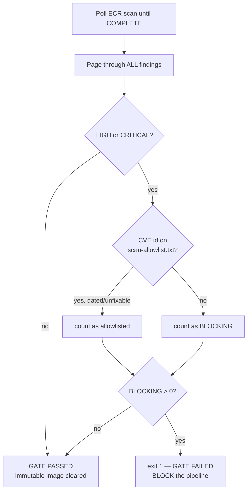
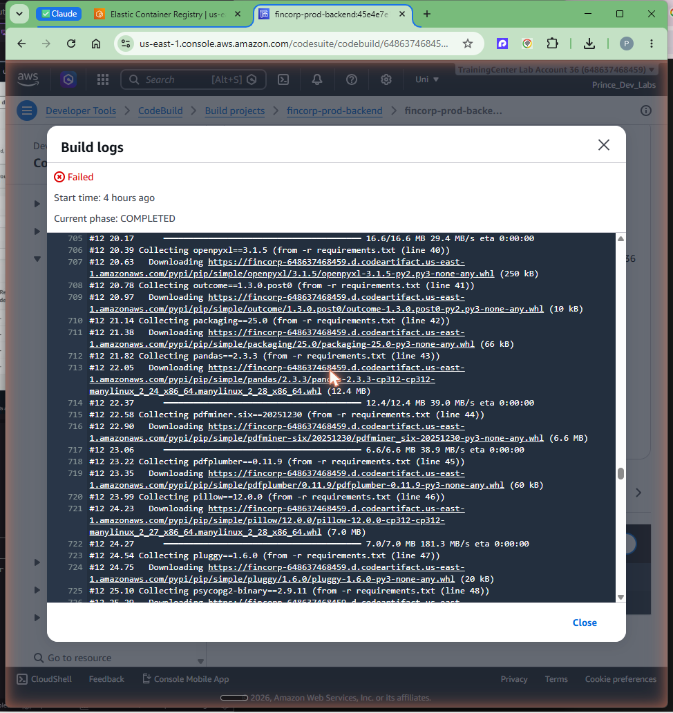
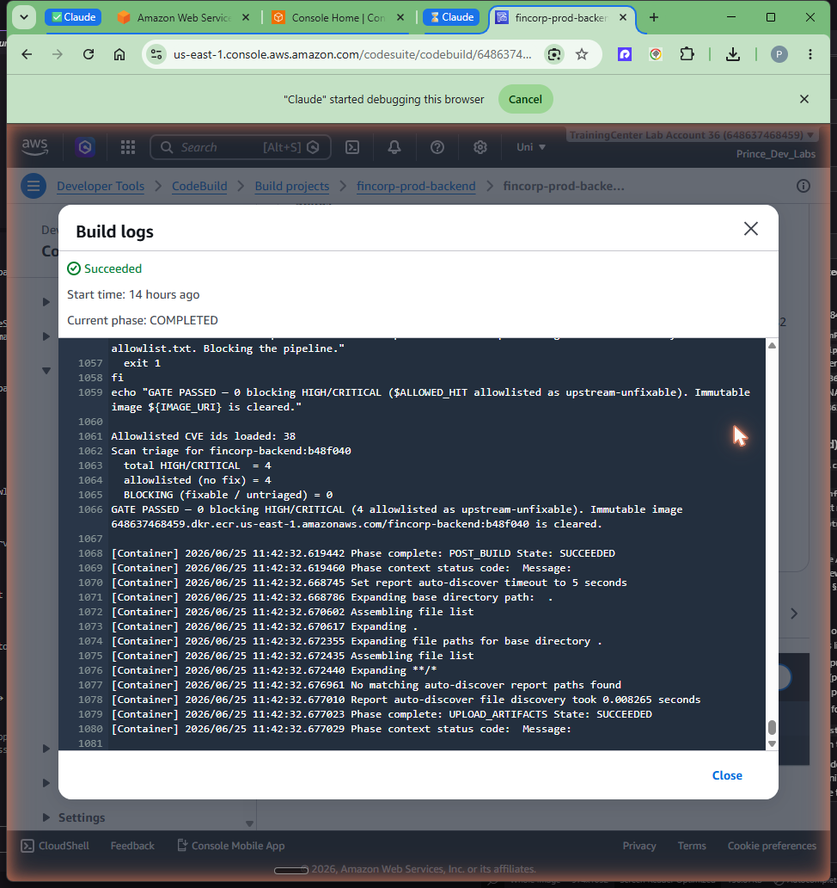

# Phase 3 — Prove the vulnerability gate

## Goal

A scan gate you never see fail is a scan gate you cannot trust. Phase 3 proves the
gate genuinely blocks a build on High/Critical vulnerabilities, then hardens it
against a real false-pass defect, and finally establishes a sane, auditable policy
for the handful of OS CVEs that have **no upstream fix**. By the end we have three
things on record: a build that was **BLOCKED** with 29 HIGH/CRITICAL findings, the
bug we found in the naive gate and how we fixed it, and a green build that passes
**only** because every remaining finding is an explicitly accepted, dated,
unfixable CVE — while any new fixable CVE would still fail the build.

All resources land in **us-east-1**, account **648637468459**.

## Prerequisites

- Phase 2 complete: `fincorp-prod-pipeline` builds and pushes both tiers, and the
  post-build scan gate runs in each CodeBuild action.
- The gate logic lives inline in the buildspecs
  (`modules/codebuild/buildspecs/backend.yml` and `frontend.yml`); changing it
  needs `terraform apply -target=module.codebuild`.
- The accepted-risk register lives at `security/scan-allowlist.txt` in the repo
  (read by the gate at build time from `${CODEBUILD_SRC_DIR}/security/...`).

## Concepts (the "why")

**A gate is only proven by watching it fail.** The non-negotiable from AGENTS.md
is that the build must fail on any High or Critical finding. The only honest way to
demonstrate that is to deliberately ship a vulnerable image and confirm the pipeline
stops. We pinned the backend base image to **`python:3.12-slim-bullseye`** — Debian
11 ("bullseye"), which is end-of-life and carries a pile of unpatched OS CVEs. The
scan found **29 HIGH/CRITICAL** findings and the gate exited non-zero, blocking the
build (pipeline execution `641c443b`, commit `928049d`). After capturing the proof
we reverted the base to a clean `python:3.12-slim`. The trade-off of this exercise
is a deliberately broken commit in history — which is fine, because the whole point
is evidence that the gate has teeth.

**The false-pass defect: never trust the scan summary.** The first instinct is to
read `imageScanFindingsSummary.findingSeverityCounts` and fail if HIGH/CRITICAL > 0.
This is **wrong on ECR basic (Clair) scanning**: the summary's
`findingSeverityCounts` frequently comes back **`null`/empty even when the
per-finding list contains HIGH/CRITICAL items**. A gate keyed off the summary would
therefore **false-pass** an image that actually has critical vulnerabilities — the
worst possible failure mode for a security control. The fix: count from the
**authoritative per-finding list** instead —
`.imageScanFindings.findings[] | select(.severity=="HIGH" or .severity=="CRITICAL")`
— and **paginate** it (findings can exceed one page). The summary is now echoed for
human context only; the decision is made on the real list.

**Basic scanning has no fixed-version field — so the allowlist is explicit, not
automatic.** Some HIGH/CRITICAL OS CVEs simply have no upstream patch available
(common in `perl` on Debian, and across the Alpine base for the frontend). You do
not want those to block the pipeline forever, but you also cannot auto-detect them:
ECR **basic** scanning exposes **no `fixedInVersion` field**, so "auto-allowlist
anything unfixable" is impossible without Amazon Inspector (enhanced scanning), which
we deliberately did **not** enable (cost + project decision). The chosen alternative
is an **explicit, auditable CVE-id allowlist** at `security/scan-allowlist.txt`: a
real accepted-risk register, each entry **dated with a reason**, reviewed by a human.
As of 2026-06-25 it holds **38 upstream-unfixable CVEs** (4 backend `perl`, 34
Alpine). The gate blocks any HIGH/CRITICAL whose CVE id is **not** on the list — so a
newly published *fixable* CVE still fails the build. The trade-off versus a blanket
bypass or a "summary > 0" gate: a little human curation, in exchange for a gate that
stays meaningful instead of being silently neutered.

### Gate decision logic



## Steps

### 1. Introduce a known-vulnerable base (prove the gate fails)

Pin the backend Dockerfile base to the EOL Debian 11 image, commit, and let the
pipeline run:

```dockerfile
# apps/backend/Dockerfile (temporary, for the gate-proof commit 928049d)
FROM python:3.12-slim-bullseye
```

The build builds and pushes `fincorp-backend:928049d`, scan-on-push fires, and the
post-build gate pages the findings, partitions them, and exits 1:

```text
Scan triage for fincorp-backend:928049d
  total HIGH/CRITICAL  = 29
  allowlisted (no fix) = 0
  BLOCKING (fixable / untriaged) = 29
GATE FAILED: 29 HIGH/CRITICAL finding(s) not on the allowlist in fincorp-backend:928049d:
    - CVE-...
    ...
Blocking the pipeline.
```

The pipeline execution `641c443b` ends in **Failed** — the image was built and
pushed (immutability is preserved) but the **build action failed**, so the artifact
is flagged and the pipeline does not go green.



### 2. Harden the gate against the summary false-pass

While reading the failed run we confirmed the basic-scan summary defect: with 29 real
findings, `imageScanFindingsSummary.findingSeverityCounts` came back empty. The gate
was changed to count from the per-finding list and paginate it:

```bash
# authoritative count — NOT the summary
jq -r '.imageScanFindings.findings[]? \
  | select(.severity=="HIGH" or .severity=="CRITICAL") | .name'
# ...looped over every page via --next-token
```

Apply the buildspec change (it is inline in Terraform):

```bash
terraform apply -target=module.codebuild
```

### 3. Revert the base and triage the unfixable remainder

Revert the backend base to clean `python:3.12-slim`. The remaining HIGH/CRITICAL
findings on both tiers are upstream-unfixable OS CVEs. Each one is reviewed and added
to `security/scan-allowlist.txt` with its date and reason — 38 entries total (4
backend `perl`, 34 Alpine).

```text
# security/scan-allowlist.txt (excerpt — every entry is dated with a reason)
CVE-XXXX-YYYY   # 2026-06-25 perl, no upstream fix on debian slim — accepted
...
```

### 4. Confirm the green run still has a meaningful gate

Re-run the pipeline. The gate now reports each finding as allowlisted and passes
with **0 blocking** — commit **`b48f040`**, execution **`8e1f45da`**:

```text
# backend
Scan triage for fincorp-backend:b48f040
  total HIGH/CRITICAL  = 4
  allowlisted (no fix) = 4
  BLOCKING (fixable / untriaged) = 0
GATE PASSED — 0 blocking HIGH/CRITICAL (4 allowlisted as upstream-unfixable).

# frontend
Scan triage for fincorp-frontend:b48f040
  total HIGH/CRITICAL  = 34
  allowlisted (no fix) = 34
  BLOCKING (fixable / untriaged) = 0
GATE PASSED — 0 blocking HIGH/CRITICAL (34 allowlisted as upstream-unfixable).
```



## Verification

- **The gate genuinely blocks:** execution `641c443b` is `Failed` with the
  `GATE FAILED: 29 HIGH/CRITICAL` log — a build with known High/Critical findings
  did **not** go green. This is the core proof from AGENTS.md §2.
- **No false-pass:** the gate counts from `.imageScanFindings.findings[]`, paginated,
  not from the summary that returns `null` on basic scanning.
- **The gate is still meaningful after the allowlist:** execution `8e1f45da` passes
  only because all 4/4 backend and 34/34 frontend findings are explicitly
  allowlisted; the `BLOCKING` count is the decision variable and it is 0. A new,
  un-listed fixable CVE would push `BLOCKING > 0` and fail the build again.
- **The register is auditable:** `security/scan-allowlist.txt` lists 38 CVE ids, each
  dated `2026-06-25` with a reason; it is version-controlled and reviewed.

## Troubleshooting

- **Gate passes a clearly vulnerable image.** You are reading the summary
  (`findingSeverityCounts`). On ECR **basic** scanning the summary is unreliable — it
  returns `null` even with real findings. Count from `imageScanFindings.findings[]`
  and paginate with `--next-token`. This was the actual defect found in Phase 3.
- **Gate misses findings on a large image.** Findings are paginated. A single
  `describe-image-scan-findings` call truncates; loop on `nextToken`.
- **"I want to auto-skip unfixable CVEs."** Not possible on basic scanning — there is
  no `fixedInVersion` field. Either enable Amazon Inspector (enhanced, costs more) or
  use the explicit dated allowlist as we do. Do **not** widen the allowlist to silence
  a *fixable* CVE — patch the base/dep instead, or the gate stops meaning anything.
- **A new CVE suddenly fails a previously-green build.** Working as intended: a newly
  published HIGH/CRITICAL that is not on the list blocks. Triage it — patch if a fix
  exists, or add a dated allowlist entry only if it is genuinely unfixable.

## Cost & teardown

Phase 3 adds no new infrastructure — it exercises the Phase 2 pipeline and edits the
inline buildspecs + the committed allowlist. The only cost is the extra CodeBuild
minutes for the proof runs and a couple of extra ECR-stored images (including the
deliberately vulnerable `928049d` backend image). To clean those up:

```bash
# remove the proof images so they don't linger / get pulled
aws ecr batch-delete-image --repository-name fincorp-backend --region us-east-1 \
  --image-ids imageTag=928049d
```

Teardown of the pipeline itself is identical to Phase 2
(`terraform destroy -target=module.codepipeline -target=module.codebuild`). Nothing
in the DR region yet.

## Key takeaways

- The gate is **proven by failure**: 29 HIGH/CRITICAL on an EOL base → build
  **BLOCKED** (`641c443b`), not asserted on paper.
- **Never trust the scan summary** on ECR basic scanning — `findingSeverityCounts`
  returns `null` with real findings. Count from the **paginated per-finding list**.
- Basic scanning has **no `fixedInVersion`**, so unfixable CVEs are handled by an
  **explicit, dated, auditable allowlist**, not an automatic skip.
- The allowlist is an **accepted-risk register**: it passes only known-unfixable
  CVEs, so a new **fixable** CVE still fails the build — the gate stays meaningful.
- Green run `b48f040` passes with **0 blocking** (backend 4/4, frontend 34/34
  allowlisted) — clean *and* honest.
