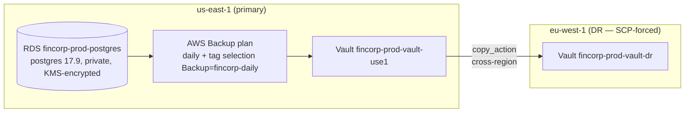
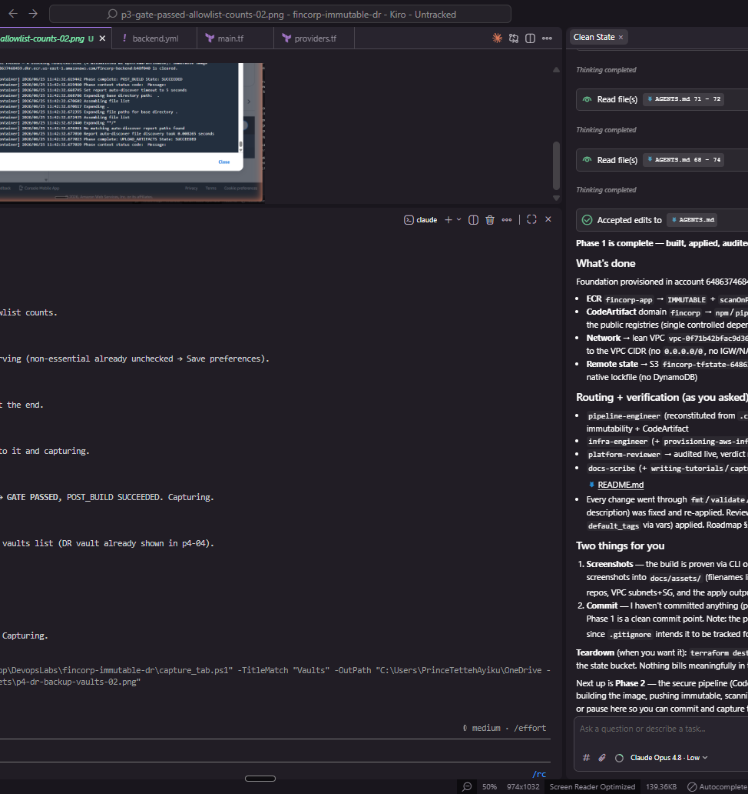
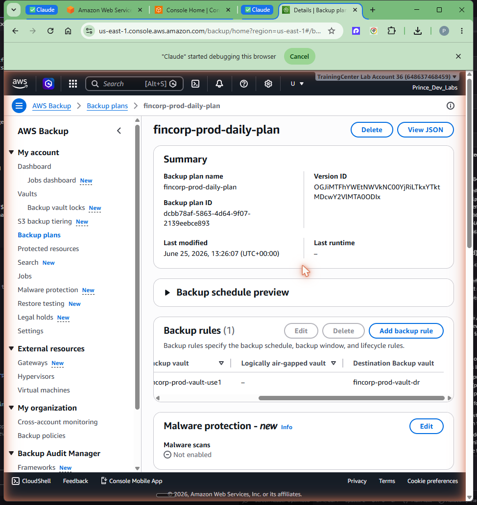
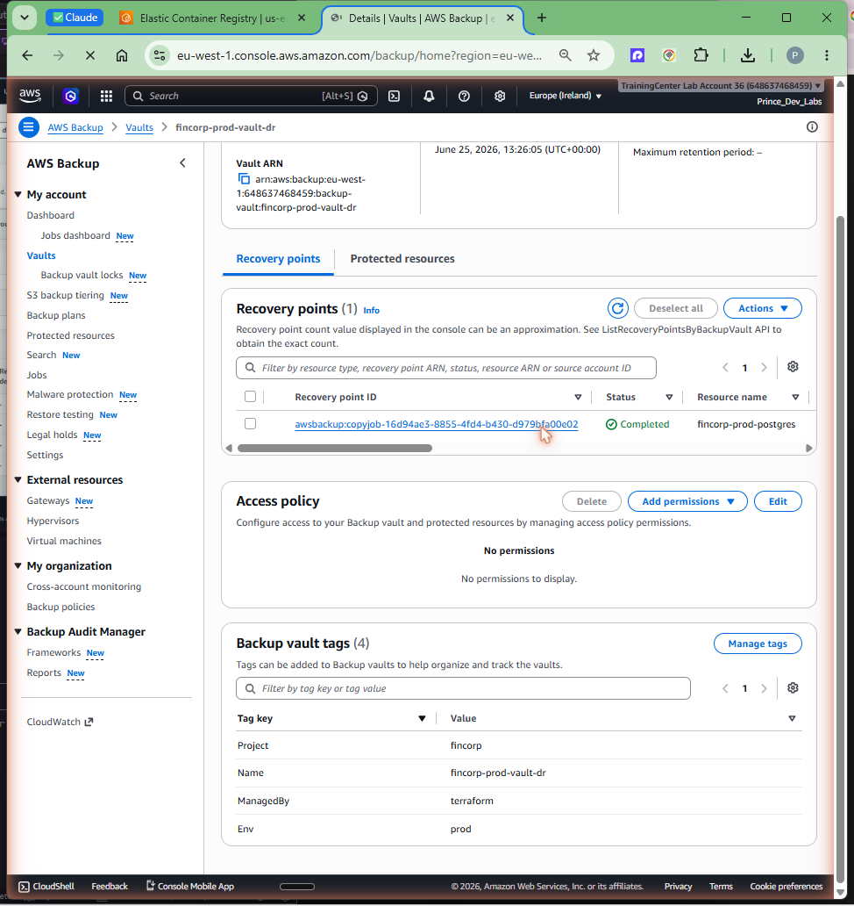

# Phase 4 — RDS + AWS Backup cross-region copy

## Goal

Objective 2 is disaster recovery: a critical database that can be restored in a
different region within 30 minutes. Phase 4 builds the foundation that makes that
drill possible — an encrypted, private **Amazon RDS PostgreSQL** instance in
us-east-1, an **AWS Backup** daily plan that snapshots it, and a **cross-region
copy** of every recovery point into a second region's vault. By the end there is a
real recovery point sitting in the DR vault, ready for Phase 5 to restore against.

This phase carries one deliberate, documented deviation from the original plan: an
org-level SCP blocks AWS Backup in the intended DR region, so the DR region is
**eu-west-1**. The 30-minute RTO target is region-agnostic, so the drill is just as
valid.

Primary region **us-east-1**, DR region **eu-west-1**, account **648637468459**.

## Prerequisites

- Phase 1 network applied: the VPC, the two private data subnets, the DB subnet
  group `fincorp-prod-db`, and the RDS security group exist in us-east-1.
- AWS CLI v2 authenticated to `648637468459` with permissions for RDS, AWS Backup,
  KMS, Secrets Manager, and IAM in both us-east-1 and eu-west-1.
- Terraform **>= 1.10**, run from `infra/terraform/envs/prod`. The root has two
  provider configs: `aws` (us-east-1, default) and `aws.usw2` (the DR-region alias).

## Concepts (the "why")

**RDS: private, encrypted, managed credentials — no plaintext anywhere.** The
instance `fincorp-prod-postgres` runs PostgreSQL **17.9** on **db.t4g.micro**
(Graviton, the cheapest current-gen class — this is a DR drill, not a production
workload) with **gp3** storage, **single-AZ** (a stand-by would double cost and adds
nothing to a *cross-region* DR story), in the **private** data subnets with **no
public access**. Storage is encrypted with the **`aws/rds` KMS key**, and the master
credential is an **RDS-managed secret in Secrets Manager** — Terraform never sees or
stores a plaintext password, and the password rotates under AWS management. This
satisfies the AGENTS.md prime directive that there be no plaintext secrets in git.

**`deletion_protection = false` and `skip_final_snapshot = true` — on purpose.**
Normally you would protect a production database from deletion and force a final
snapshot. Here the **whole point of Phase 5 is to delete the primary** and prove we
can recover from the cross-region copy. Deletion protection would block the drill,
and a final snapshot would be a same-region safety net that defeats the test — the
recovery must lean on the **cross-region backup**, nothing else. So both are
deliberately relaxed for the lab. In a real production setup you would flip both back
on.

**AWS Backup with a cross-region copy action.** A backup plan in the source vault
`fincorp-prod-vault-use1` (us-east-1) runs **daily** and, in the same rule, has a
**`copy_action`** that replicates each recovery point into the DR vault
`fincorp-prod-vault-dr` (eu-west-1). Selection is **tag-based** — anything tagged
`Backup = fincorp-daily` is picked up — so adding a future resource to the plan is
just a tag, not a Terraform change to the selection. A dedicated, **least-privilege
backup IAM role** does the work (it can back up and copy, nothing more). The
trade-off of cross-region copy is storage cost in two regions and copy egress, which
is exactly the cost of a real DR posture.

**The deviation: DR region is eu-west-1, forced by an org SCP.** The original plan
targeted us-west-2 for DR. An organization Service Control Policy (`p-339lo1q0`)
**denies AWS Backup writes in us-west-2 and across all US/CA regions**, so a copy job
into us-west-2 is rejected outright. The pragmatic, honest fix is to put the DR vault
in **eu-west-1** — still a genuinely separate region (in fact a more aggressive,
trans-Atlantic separation), and the 30-minute RTO objective does not depend on which
region we recover into. The Terraform provider alias is still named `aws.usw2` for
continuity with the original design; only its `region` value points at eu-west-1.
This is the kind of real-world constraint worth documenting rather than papering over.

### Backup topology



## Steps

All commands run from `infra/terraform/envs/prod` unless noted.

### 1. Apply the RDS + Backup stack

Terraform provisions the RDS instance (into the Phase 1 subnet group + SG), both
vaults (source via the default `aws` provider, DR via the `aws.usw2`→eu-west-1
alias), the daily plan with the cross-region `copy_action`, the tag-based selection,
and the least-privilege backup role.

```bash
terraform init
terraform plan
terraform apply     # review, type 'yes'
```

### 2. Confirm the database is private, encrypted, and uses a managed secret

```bash
aws rds describe-db-instances --db-instance-identifier fincorp-prod-postgres \
  --region us-east-1 \
  --query "DBInstances[0].{engine:EngineVersion,public:PubliclyAccessible,enc:StorageEncrypted,class:DBInstanceClass,secret:MasterUserSecret.SecretArn}"
```

```json
{
  "engine": "17.9",
  "public": false,
  "enc": true,
  "class": "db.t4g.micro",
  "secret": "arn:aws:secretsmanager:us-east-1:648637468459:secret:rds!db-..."
}
```

`public=false`, `enc=true`, and a Secrets Manager `MasterUserSecret` — no plaintext
password anywhere.


### 3. Seed a recovery point and copy it cross-region

To have something to restore in Phase 5 without waiting for the daily schedule, run an
on-demand backup and let the copy action replicate it to eu-west-1:

```bash
aws backup start-backup-job \
  --backup-vault-name fincorp-prod-vault-use1 \
  --resource-arn arn:aws:rds:us-east-1:648637468459:db:fincorp-prod-postgres \
  --iam-role-arn <backup-role-arn> --region us-east-1
```

Both the backup job and the cross-region copy job run to **COMPLETED**, leaving a
recovery point in the DR vault.





## Verification

### Both vaults exist (one per region)

```bash
aws backup describe-backup-vault --backup-vault-name fincorp-prod-vault-use1 --region us-east-1
aws backup describe-backup-vault --backup-vault-name fincorp-prod-vault-dr   --region eu-west-1
```

### A recovery point landed in the DR vault

```bash
aws backup list-recovery-points-by-backup-vault \
  --backup-vault-name fincorp-prod-vault-dr --region eu-west-1 \
  --query "RecoveryPoints[].{arn:RecoveryPointArn,status:Status}"
```

The DR vault holds at least one recovery point in `COMPLETED` status — this is the
exact recovery point Phase 5 restores from.



## Troubleshooting

- **Copy job to us-west-2 is denied.** This is the SCP (`p-339lo1q0`) denying AWS
  Backup writes in US/CA regions, including us-west-2. There is no workaround inside
  the account — the DR region must be outside the denied set. We use **eu-west-1**.
  If your org has a different SCP, pick any allowed non-primary region; the drill is
  region-agnostic.
- **RDS won't delete in Phase 5 because of deletion protection.** Confirm
  `deletion_protection = false` on this instance — it is intentionally off so the DR
  drill can delete the primary.
- **No recovery point to restore.** The daily schedule may not have fired yet. Run the
  on-demand `start-backup-job` in Step 3 and wait for both the backup job and the copy
  job to reach `COMPLETED` before starting Phase 5.

## Cost & teardown

**While running**, this phase bills continuously: the **RDS instance** (db.t4g.micro
+ gp3 storage) runs 24/7, and **AWS Backup stores recovery points in two regions**
plus cross-region copy egress. This is the first phase with always-on cost — do not
leave it running idle.

Full teardown (do this when finished, both regions):

```bash
# 1. Empty both vaults — recovery points block vault deletion.
#    (delete each recovery point in fincorp-prod-vault-use1 / -dr)
aws backup delete-recovery-point --backup-vault-name fincorp-prod-vault-use1 \
  --recovery-point-arn <arn> --region us-east-1
aws backup delete-recovery-point --backup-vault-name fincorp-prod-vault-dr \
  --recovery-point-arn <arn> --region eu-west-1

# 2. Destroy the Terraform-managed Phase 4 resources (RDS, vaults, plan, role).
terraform destroy   # from infra/terraform/envs/prod
```

> **Phase 5 leaves non-Terraform resources behind.** The DR drill creates an
> eu-west-1 restored DB, security group, and DB subnet group **with the CLI, outside
> Terraform state** — `terraform destroy` will not remove them. See the Phase 5
> teardown for the exact manual cleanup. If you have already run Phase 5, do that
> cleanup too.

## Key takeaways

- RDS is **private, KMS-encrypted, single-AZ, with an RDS-managed Secrets Manager
  credential** — no plaintext password, minimal footprint for a DR drill.
- `deletion_protection=false` + `skip_final_snapshot=true` are **deliberate** so
  Phase 5 can delete the primary and recover *only* from the cross-region copy.
- AWS Backup runs a **daily plan with a `copy_action`** that replicates every
  recovery point to the DR vault, driven by **tag-based selection** and a
  **least-privilege** role.
- The DR region is **eu-west-1**, not us-west-2, because an org **SCP (`p-339lo1q0`)
  denies Backup writes in US/CA regions** — a real constraint, documented, not hidden.
- This is the **first always-on-cost phase** (RDS + dual-region backup storage) —
  remember the teardown.
