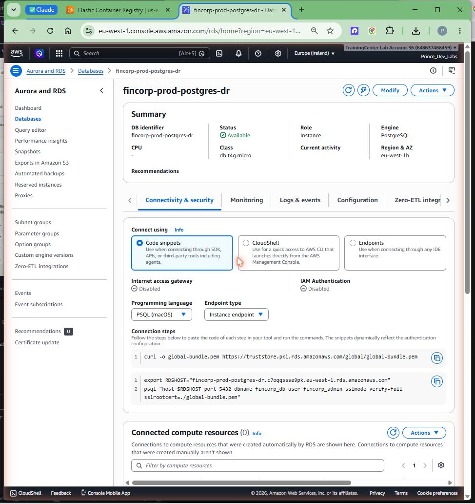

# Phase 5 — DR drill and RTO measurement

## Goal

This is the moment the whole DR story is proven instead of asserted: we **delete the
primary database** to simulate a region failure, **restore it in the DR region** from
the cross-region recovery point, and **measure the wall-clock recovery time** against
the 30-minute objective. The headline result: **end-to-end RTO = 26m02s — PASS**. The
chapter keeps the messy parts in, including the first restore attempt that failed,
because the lesson is the point.

Primary region **us-east-1**, DR region **eu-west-1**, account **648637468459**.

## Prerequisites

- Phase 4 complete: `fincorp-prod-postgres` is running in us-east-1, and the DR vault
  `fincorp-prod-vault-dr` in eu-west-1 holds a `COMPLETED` recovery point (the
  cross-region copy).
- AWS CLI v2 authenticated to `648637468459` with RDS + AWS Backup permissions in
  both regions.
- A wall clock. RTO is measured from "disaster declared" to "restored DB available".

## Concepts (the "why")

**RTO is measured end-to-end, from the disaster, not from the restore command.** The
30-minute objective is about how long the business is down. So the timer starts at
**DISASTER DECLARED** — the instant the primary is deleted — and stops when the
restored DB is **`available`** in the DR region and verified. That envelope includes
deciding what to restore, locating the recovery point, building the DR-side
networking, the restore job itself, and the database coming up. Timing only the
restore API call would flatter the number and miss the real recovery time.

**Restore from the cross-region copy, not a same-region snapshot.** The restore reads
the recovery point that AWS Backup copied into the eu-west-1 vault in Phase 4
(`copyjob-16d94ae3...`), via `aws backup start-restore-job`. This is the genuine DR
path: us-east-1 is treated as gone, and the database is reconstituted purely from what
was replicated to the DR region.

**DR networking is built at drill time and is *not* in Terraform state.** To land the
restored instance you need a place to put it: a security group and a DB subnet group in
the eu-west-1 default VPC. These were created **with the CLI during the drill**
(SG `sg-0dd2c654e6a4596ab`, DB subnet group `fincorp-prod-db-dr`), deliberately
outside Terraform — the root's `aws.usw2` alias manages backup resources, not a full DR
VPC. The trade-off is honesty about teardown: because these are not in TF state,
`terraform destroy` will not remove them, so the teardown section calls them out
explicitly for manual deletion.

## Steps

### 1. Declare the disaster (delete the primary)

This is the simulated region failure. **DISASTER DECLARED — 2026-06-25T13:48:49Z.**

```bash
aws rds delete-db-instance \
  --db-instance-identifier fincorp-prod-postgres \
  --skip-final-snapshot --region us-east-1
```

`--skip-final-snapshot` is what makes this a real test: there is **no same-region
safety net**, recovery must come from the cross-region copy alone. (Phase 4 set
`deletion_protection=false` precisely so this command would succeed.)

### 2. Build the DR-side landing zone (CLI, not Terraform)

Create the security group and DB subnet group in the eu-west-1 default VPC for the
restored instance:

```bash
# SG sg-0dd2c654e6a4596ab and DB subnet group fincorp-prod-db-dr
aws ec2 create-security-group --group-name fincorp-prod-rds-sg-dr ... --region eu-west-1
aws rds create-db-subnet-group --db-subnet-group-name fincorp-prod-db-dr ... --region eu-west-1
```

> These resources are **not in Terraform state** — note them for teardown.

### 3. Restore from the cross-region recovery point

```bash
aws backup start-restore-job \
  --recovery-point-arn <copyjob-16d94ae3... recovery point ARN> \
  --iam-role-arn <backup-role-arn> --region eu-west-1 \
  --metadata '{ ... "DBInstanceIdentifier":"fincorp-prod-postgres-dr",
                "DBSubnetGroupName":"fincorp-prod-db-dr",
                "VpcSecurityGroupIds":"sg-0dd2c654e6a4596ab", ... }'
```

The **first attempt failed** with `DBName must be null` (see Troubleshooting). After
removing `DBName` from the metadata, the restore ran cleanly. The restore mechanism
itself took ~9 minutes (**14:05:50 → 14:14:51**).

### 4. Recovery complete — stop the clock

The restored instance `fincorp-prod-postgres-dr` reached `available`.
**RECOVERY COMPLETE — 2026-06-25T14:14:51Z.**

```text
DISASTER DECLARED   2026-06-25T13:48:49Z
RECOVERY COMPLETE   2026-06-25T14:14:51Z
------------------------------------------
END-TO-END RTO      26m02s   PASS (< 30 min)
```



## Verification

### The restored DB is available, private, encrypted, same engine

```bash
aws rds describe-db-instances --db-instance-identifier fincorp-prod-postgres-dr \
  --region eu-west-1 \
  --query "DBInstances[0].{status:DBInstanceStatus,engine:EngineVersion,public:PubliclyAccessible,enc:StorageEncrypted}"
```

```json
{ "status": "available", "engine": "17.9", "public": false, "enc": true }
```

The DR database matches the primary's posture — PostgreSQL **17.9**, **private**,
**encrypted** — confirming a faithful restore, not a degraded one.

### The RTO meets the objective

End-to-end **26m02s < 30m** → **PASS**. For context, the restore *mechanism* was only
~9 minutes; the rest of the envelope was disaster declaration, locating the recovery
point, building the DR landing zone, and the failed-then-corrected restore attempt —
all legitimately part of real recovery time.


## Troubleshooting

- **First restore failed: `DBName must be null`.** AWS Backup restores of a PostgreSQL
  RDS instance reject a `DBName` value in the restore metadata — for the postgres
  engine it must be omitted/null. **Fix:** remove `DBName` from the `--metadata` and
  re-run `start-restore-job`. This is a real lesson: read the restore metadata schema
  for your engine; the same JSON that works for some engines is rejected for postgres.
- **Restore lands but can't be reached.** The DR-side SG/subnet group must exist first
  (Step 2). The restored instance has no useful networking until you provide a DB
  subnet group and security group in the DR VPC.
- **Recovery point not found in eu-west-1.** Confirm Phase 4's cross-region copy job
  reached `COMPLETED` in `fincorp-prod-vault-dr` before declaring the disaster — you
  cannot restore what was never copied.

## Cost & teardown

**The restored eu-west-1 DB bills 24/7** just like the primary did, and the recovery
points still consume storage in both regions. Tear everything down when the drill is
documented.

Full teardown, in order, **both regions**:

```bash
# 1. Empty both vaults (recovery points block vault deletion).
aws backup delete-recovery-point --backup-vault-name fincorp-prod-vault-use1 \
  --recovery-point-arn <arn> --region us-east-1
aws backup delete-recovery-point --backup-vault-name fincorp-prod-vault-dr \
  --recovery-point-arn <arn> --region eu-west-1

# 2. Terraform-managed Phase 4 resources (vaults, plan, role; primary RDS already deleted).
terraform destroy   # from infra/terraform/envs/prod

# 3. The CLI-created eu-west-1 resources — NOT in Terraform state, delete by hand:
aws rds delete-db-instance --db-instance-identifier fincorp-prod-postgres-dr \
  --skip-final-snapshot --region eu-west-1
aws rds delete-db-subnet-group --db-subnet-group-name fincorp-prod-db-dr --region eu-west-1
aws ec2 delete-security-group --group-id sg-0dd2c654e6a4596ab --region eu-west-1
```

> **Do not forget step 3.** The restored DB (`fincorp-prod-postgres-dr`), the DB
> subnet group (`fincorp-prod-db-dr`), and the SG (`sg-0dd2c654e6a4596ab`) were created
> outside Terraform during the drill, so `terraform destroy` leaves them running and
> billing in eu-west-1. Delete them manually.

If you are fully done with Objective 1 too, empty the IMMUTABLE ECR repos and destroy
the pipeline stack (see Phase 2 teardown).

## Key takeaways

- DR is **proven and timed**: primary deleted at 13:48:49Z, restored DB available at
  14:14:51Z — **end-to-end RTO 26m02s, PASS** against the 30-minute objective.
- RTO is measured **from the disaster to a verified-available DB**, not just the
  restore call — that is the number the business actually cares about.
- Recovery came **only from the cross-region copy** (`--skip-final-snapshot` removed
  the same-region net), proving the real DR path.
- The restore **mechanism** was ~9 minutes; the rest of the envelope (declaration,
  landing-zone build, the corrected failed attempt) is genuine recovery work.
- **`DBName must be null`** for postgres restores — a real gotcha; omit it from the
  restore metadata.
- The DR landing zone (`sg-0dd2c654e6a4596ab`, `fincorp-prod-db-dr`) and the restored
  DB are **not in Terraform state** — they must be torn down manually.
